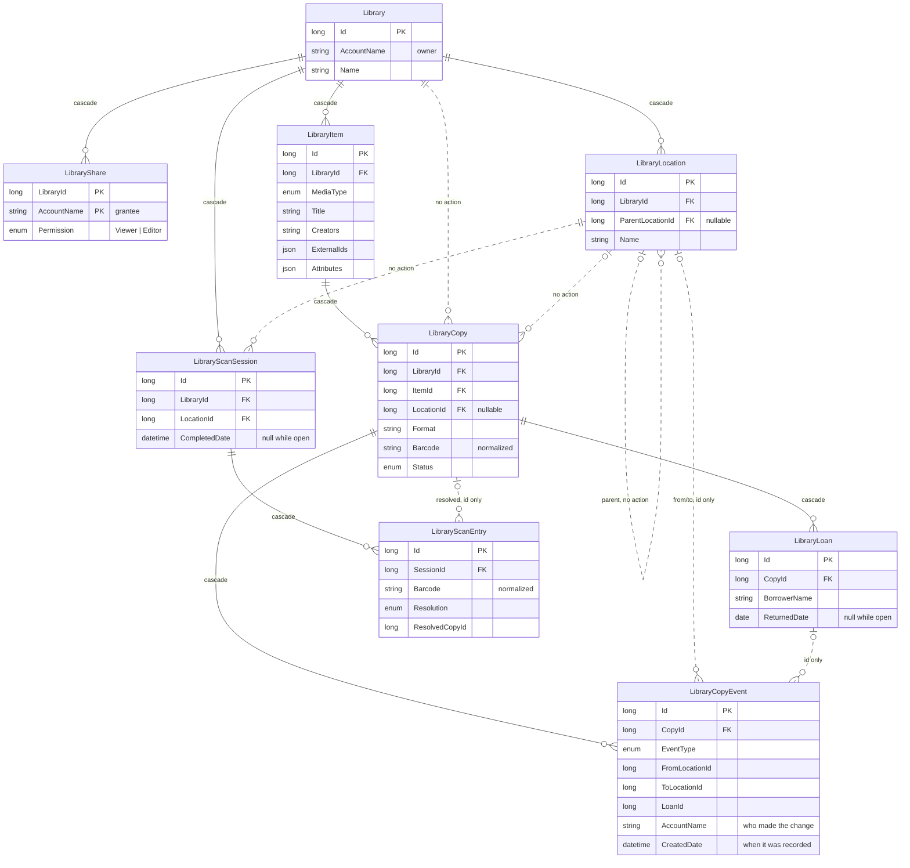
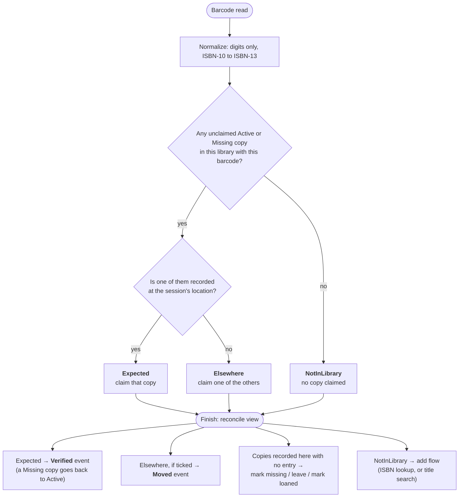

# Library

A personal inventory of physical media: books, movies and board games, plus anything else loanable. For each copy it
records where it lives, who borrowed it, the history of both, and acquisition details. A library can be shared with other
accounts as read-only or editable. The phone is the main tool, used two ways: checking "do I already own this?" while
shopping, and scanning barcodes to build the first inventory and later to reconcile one location at a time.

This is deliberately not a full library system. There are no holds, fines, patrons or cataloguing standards.

**Status.** The data model and migration exist (`src/Contracts/Libraries/`, `NsContext` `#region Library`,
`Migrations/*_AddLibrary`). The API, Client, Tool, UI, external lookup and scanning described below are the plan for the
remaining work, in the order listed under [Delivery order](#delivery-order).

## Data model: item → copy

The Contracts classes are the EF entities, the same as Ledger. There are two levels, and that split is what handles
duplicates:

- **`LibraryItem`** is the work, e.g. *The Hobbit*. It holds the title, creators, series, summary, cover and external ids.
- **`LibraryCopy`** is one physical object. It holds format, barcode, edition details (publisher, year), location,
  condition, acquisition details and status.

A hardcover and a paperback are one item with two copies. Two identical paperbacks in different rooms are also one item
with two copies. The "do I own this?" answer reads naturally from that: *The Hobbit — 2 copies: Hardcover (Office ›
Shelf 3), Paperback (Kids' room)*.

**Rejected: work → edition → copy.** That is the "correct" bibliographic model (roughly FRBR), and it avoids repeating
edition details when you own two copies of the same edition. It was rejected because owning two identical copies is rare,
and repeating a publisher and year on two rows is cheap. A third level, on the other hand, puts an extra screen or choice
into every add and every scan. Edition details live on the copy. If a lookup returns edition-level data, such as a
cover that differs per edition, the item gets it from the first copy added.

**Recognizing an existing item.** Scanning an ISBN that isn't in the library yet doesn't automatically create a new
item. The ISBN lookup returns an Open Library work key, which is stored in `LibraryItem.ExternalIds`. If an item in the
library already has that key, or failing that the same normalized title and first creator, the add flow offers "add as
another copy of *X*". That is how a paperback joins the hardcover's item instead of creating a duplicate.

**Media types.** `LibraryMediaType` is an enum stored as a string (`NVARCHAR(32)`, the same way as `AccountTier`), so
adding a value needs no migration. Fields that only apply to some types (page count, runtime, player count, play time)
go in `LibraryItem.Attributes`, a string dictionary stored as a JSON column. That avoids a column per type-specific field
or a table per type. `Format` on the copy is a free string with suggested values per media type, not an enum. New
formats show up (Steelbook, 4K + Blu-ray combo), and none of them change any behaviour.

**Creators and tags** are single semicolon-separated strings, like `Account.Roles`, searched with `LIKE`. A creators
table would allow "everything by this author" with an exact match, but at personal-library volumes a `LIKE` on one
column is just as good and much less code.

**Barcodes are stored normalized**, as digits only, with ISBN-10 converted to ISBN-13, on both `LibraryCopy.Barcode`
and `LibraryScanEntry.Barcode`. A book scanned from its EAN-13 barcode and the same book typed in as an ISBN-10 from the
copyright page have to match. Every write path must normalize before storing, or lookups quietly miss.

**History.** `LibraryCopyEvent` is append-only and written by the server whenever a copy's location, loan or status
changes. It also records which account made the change, because editors exist. `CreatedDate` is when the event was
recorded, and events are never edited after that.

**When a copy was acquired** comes from `LibraryCopy.AcquiredDate` (when set), not from its `Acquired` event's
`CreatedDate`. An initial inventory records a shelf of books bought over ten years all on the day it is scanned. The
real purchase dates often get filled in much later, by editing the copies. Because the acquisition time is read from
the copy, editing `AcquiredDate` moves the book's arrival in history and in the [gource export](#gource-export-planned)
without touching the event log.

**Rejected: an `EffectiveDate` on the event**, copied from `AcquiredDate` when the copy is created. It goes stale the
moment the purchase date is corrected, and keeping it current would mean editing an append-only table to keep a second
copy of a fact the copy already holds. That is the drift this repo avoids elsewhere.

The same rule covers loans, which already carry their real dates: a `Loaned` event's time is its loan's `LoanedDate`,
and a `Returned` event's is its `ReturnedDate`. Recording a loan that started last March puts it in March.

One helper computes event times for both the item page's history and the export. It walks a copy's events in recorded
order (`CreatedDate`, then `Id`):

- `Acquired` takes the copy's `AcquiredDate`, `Loaned` its loan's `LoanedDate`, and `Returned` its loan's
  `ReturnedDate`, each at start of day. When that date isn't set, or for any other event type, the event takes its
  `CreatedDate`.
- Each time is then clamped up to at least the previous event's time.

The clamp keeps a copy's events in recorded order whatever dates are entered. A copy never moves or gets lent before it
arrives, and a loan backdated past a move that was recorded before it lands at the move instead of before it. The
[gource export](#gource-export-planned) depends on that order.

Loans have their own table (`LibraryLoan`, at most one open per copy), since they carry their own fields (due date,
borrower). The event log references a loan rather than duplicating it.

**Loanees** are a free-text `BorrowerName`, optionally linked to an account via `BorrowerAccountName`. Most borrowers
are friends without accounts. The link exists so a borrower with an account could later see what they have out.

### Delete behaviour

In the diagram, solid lines cascade on delete. Dashed lines labelled `no action` are foreign keys that block the delete.
Dashed lines labelled `id only` are plain columns with no foreign key.

SQL Server refuses to create a schema where a table can be reached by two cascade paths. `LibraryCopy` has both
`LibraryId` and `ItemId`, and `LibraryItem` cascades from `Library`, so `Library → Copy` directly would be a second path.
The cascades are therefore:

- `Library → Item → Copy → Loan / Event`
- `Library → Location`, `Library → Share`, `Library → ScanSession → ScanEntry`

Every other foreign key into a copy or location (`Copy.LibraryId`, `Copy.LocationId`, `Location.ParentLocationId`,
`ScanSession.LocationId`) is `NoAction`. Deleting a library should still remove everything in one statement, since SQL
Server checks `NO ACTION` constraints after the statement's cascades have run. That hasn't been exercised against a real
database yet. If it fails, the delete action should remove copies, then items and locations, then the library,
explicitly. Deleting a location that still has copies or children fails, which is what the API should turn into a 409.

The location and loan ids on `LibraryCopyEvent` and the copy id on `LibraryScanEntry` are plain columns, not foreign keys,
so history survives the rows it mentions being deleted. The UI shows a deleted location as "(deleted location)" instead
of hiding the event.

### Naming

The namespace is `TcpWtf.NumberSequence.Contracts.Libraries`, not `.Library`, because the root entity is called
`Library`. A type with the same name as its namespace causes CS0118 in any file whose enclosing namespace makes `Library`
resolve to the namespace first. The Razor Pages folder has the same problem (`Pages/UI/Library` would make
`number_sequence.Pages.UI.Library` a namespace), so it should be `Pages/UI/Libraries`, with routes still under
`/ui/library`.

## Access and sharing

- `AccountRoles.Library` gates the whole feature. Everyone who uses a library needs it, including people it is shared
  with. `Account.Roles` was widened from 64 to 256 characters in the same migration, since adding `Library` brings the
  current set to 35.
- `LibraryShare(LibraryId, AccountName, Permission)` grants `Viewer` or `Editor`. `Owner` is never stored on a share: the
  owner is `Library.AccountName`. `LibraryPermission` is ordered (`Viewer < Editor < Owner`) so a check is a single
  comparison.
  - **Owner:** everything, plus managing shares and renaming or deleting the library.
  - **Editor:** add and change items, copies, locations, loans and scans.
  - **Viewer:** read only.
- `Library.CallerPermission` is `[NotMapped]`. The API fills it per request so the UI knows which controls to show.
- **Every library-scoped API action goes through a single access helper** (`GetLibraryAccessAsync(libraryId,
  minimumPermission)`). It resolves owner, share or not-found, and throws `NotFoundException` when access is too low.
  Nothing filters on `AccountName == User.Identity.Name` directly. That is the Ledger pattern, and copied here it
  would quietly lock out everyone a library is shared with. Not-found rather than forbidden, so a library id doesn't
  reveal that it exists.
- The owner shares by account name, and the server checks the account exists. There is no invite flow.
- Tier limits: `TierLimits.LibrariesPerAccount` counts owned libraries only. `LibraryCopiesPerLibrary` uses the owner's
  tier (3,000 copies on Small).

## API, Client, Tool (planned)

`LibraryController` (partial, one file per sub-resource like Ledger) at `/library`, with `RequiresToken(AccountRoles.Library)`.
Everything is nested under `libraries/{libraryId}` except two routes that span libraries:

- `barcodes/{barcode}` is the "do I own this?" check across **every library the caller can access**. The shopping case
  shouldn't make you choose a library first.
- `lookup/isbn/{isbn}` and `lookup/search?mediaType=&q=` call outside services and save nothing.

Moves, loans, returns and status changes are their own actions (`copies/{id}/move`, `/loan`, `/return`, `/status`)
rather than general PUTs, because each one writes a `LibraryCopyEvent`. A general PUT of a copy doesn't change
`LocationId` or `Status`.

The Client is `LibraryOperations` (partial, one file per sub-resource) exposed as `NsTcpWtfClient.Library`. The Tool is
`library` (alias `lib`), with the usual CRUD aliases, plus `owned <barcode>` and `export <libraryId> <file.csv>`.

## Gource export (planned)

[Gource](https://gource.io) animates a version-control history as a growing tree. Its
[custom log format](https://github.com/acaudwell/Gource/wiki/Custom-Log-Format) is one line per change,
`timestamp|user|A/M/D|path|colour`, which makes it an easy way to watch a library fill up and move around over the
years. The export is `GET library/libraries/{id}/events/gource` (text/plain), with `library export-gource <libraryId>
<file.log>` in the Tool, then `gource file.log`.

Mapping:

- **Path:** `/{location path}/{title} ({format}) #{copyId}`, so locations are the directories and each copy is a file.
  The copy id keeps two identical paperbacks from collapsing into one file. `|` and `/` in names are replaced, since
  they are the format's field and path separators. A copy with no location sits under `/(no location)/`, a loaned
  copy under `/(on loan)/{borrower}/`, and a missing copy under `/(missing)/`.
- **Colour:** one per `MediaType`, rather than gource's default of colouring by file extension, which here would mean
  nothing.
- **User:** the event's `AccountName`, so an editor's activity shows up as a second person working on the tree.
- **Events:** `Acquired` and `Restored` → `A`. `Verified` → `M` (a pulse on the file). `Disposed` → `D`. Gource
  has no rename, so `Moved`, `Loaned`, `Returned` and `MarkedMissing` each become a `D` at the old path followed by an
  `A` at the new one, both with the same timestamp.
- **Time:** the event time from the shared helper (see [History](#data-model-item--copy)) as unix seconds, sorted
  ascending with `Id` to break ties, because gource requires the log to be in order. The sort must be stable: clamping
  can give several of a copy's events the same time, and they still have to come out in recorded order.

Because the helper's clamp keeps each copy's events in recorded order, the `D` half of each move can use the event's
stored `FromLocationId`, and it names a file gource has already seen. A `D` for a path gource has never seen leaves an
orphaned file in the tree. That is why the clamp exists, and why a date on a copy or loan can never reorder that copy's
events.

Paths use location names as they are now, since locations don't keep a name history. A renamed shelf shows under its
new name for its whole history. A deleted location shows as `(deleted location #id)`.

## External lookup (planned)

Behind an `ILibraryLookupProvider` interface. A provider whose key isn't configured turns itself off, and the UI falls
back to entering details by hand.

- **Books by ISBN:** Open Library first (`/isbn/{isbn}.json`, then the work record for summary and authors). It needs no
  key, and its work key is what makes duplicate detection work. Google Books (`volumes?q=isbn:`) is the fallback when Open
  Library has no record, with an optional key.
- **Movies by title:** TMDB `search/movie` and `search/tv`, with a bearer token. A UPC doesn't identify a movie in TMDB,
  so a scanned UPC is saved on the copy (a rescan finds it) and the details come from a title search. TMDB's terms
  require attribution on pages showing its data.
- **Board games by title:** BoardGameGeek XML API2 (`search?type=boardgame`, then `thing?id=`). BGG has required a
  registered application token since 2025.

Rejected: UPC databases (e.g. UPCitemdb's free tier). Their results for movies and games are thin and inconsistent, and
the free tiers are rate limited to around 100 a day, which a first inventory run blows through.

Covers are downloaded from the provider when the item is created and stored in blob storage (container `library`, path
`covers/{itemId}`). They are not stored as SQL bytes like the Ledger logos, because a few thousand covers at 20–100 KB
each doesn't belong in the database. They are never hotlinked, because provider URLs change and hotlinking leaks
browsing to third parties. The new container has to be added to `storageAccountContainerNames` in
`build/jobs/deploy-prereqs.yml`, for both the prod and the LocalDev job. Lookup keys go in `Options.Library` and
`deployment/templates/AppServiceSettings.json`.

## Scanning and reconciling (planned)

The same flow handles first-time inventory and later reconciling:

1. Pick a location. This starts a `LibraryScanSession`.
2. Scan continuously. Each barcode becomes a `LibraryScanEntry`, stored on the server as it is scanned, so a phone that
   locks or reloads mid-shelf loses nothing. Keeping the state in browser memory was rejected for exactly that reason.
3. Each entry is resolved when scanned: `Expected` (a copy with this barcode is recorded here), `Elsewhere` (recorded at
   another location or none), or `NotInLibrary`.
4. **Finish** shows the reconcile view:
   - verified;
   - to move here;
   - expected here but not scanned (mark missing, leave as is, or mark loaned);
   - new barcodes (ISBNs can be added in bulk through lookup; others are added one at a time by title).
5. Applying the reconcile writes the events and sets `CompletedDate`.

For a first inventory nothing is expected anywhere yet, so every entry is `NotInLibrary` and the reconcile becomes "add
everything".

**Duplicates while scanning.** Each scan matches at most one copy, and an earlier scan in the same session claims its
copy first. "Unclaimed" means not already the `ResolvedCopyId` of an earlier entry in the session. When several copies
share the barcode, a copy recorded at this location is claimed before one recorded elsewhere, so scanning a shelf never
reports a move for a copy that was already there. Two copies of the same paperback therefore need two scans. A third
scan of that barcode resolves to `NotInLibrary`, which is correct: it's a copy you didn't know you had. An accidental
double scan is fixed by removing the entry.

`Missing` copies are matched along with `Active` ones, because scanning a missing copy is how it gets found. `Disposed`
copies are not matched. A disposed copy that turns up again is restored deliberately from its item page, not by a scan.

**Camera.** There is no `wwwroot`, so the scanner is loaded from jsDelivr like Bootstrap. It is the `barcode-detector`
ponyfill (zxing-wasm), which uses the browser's native `BarcodeDetector` where there is one (Android Chrome) and WASM
elsewhere. iOS Safari has no native `BarcodeDetector`, which rules out using the native API alone. The scanner reads
EAN-13, UPC-A and UPC-E and debounces repeat reads of the same code. A text box is always there as well, and a USB or
Bluetooth handheld scanner works through it as a keyboard. The scan page calls the `/library/...` API directly with
`fetch`, using the `ns-token` cookie `RequiresTokenFilter` already accepts. That avoids page handlers and antiforgery
tokens for what is the only JS-heavy page.

## Delivery order

1. **Core:** the data model (done), then the access helper and full API, Client and Tool CRUD, and UI for browse,
   search, detail, manual add/edit, loans, locations and shares.
2. **Lookup:** barcode normalization, the providers, covers in blob, and options and deployment settings.
3. **Scanning:** the camera scanner, scan sessions and the reconcile view.
